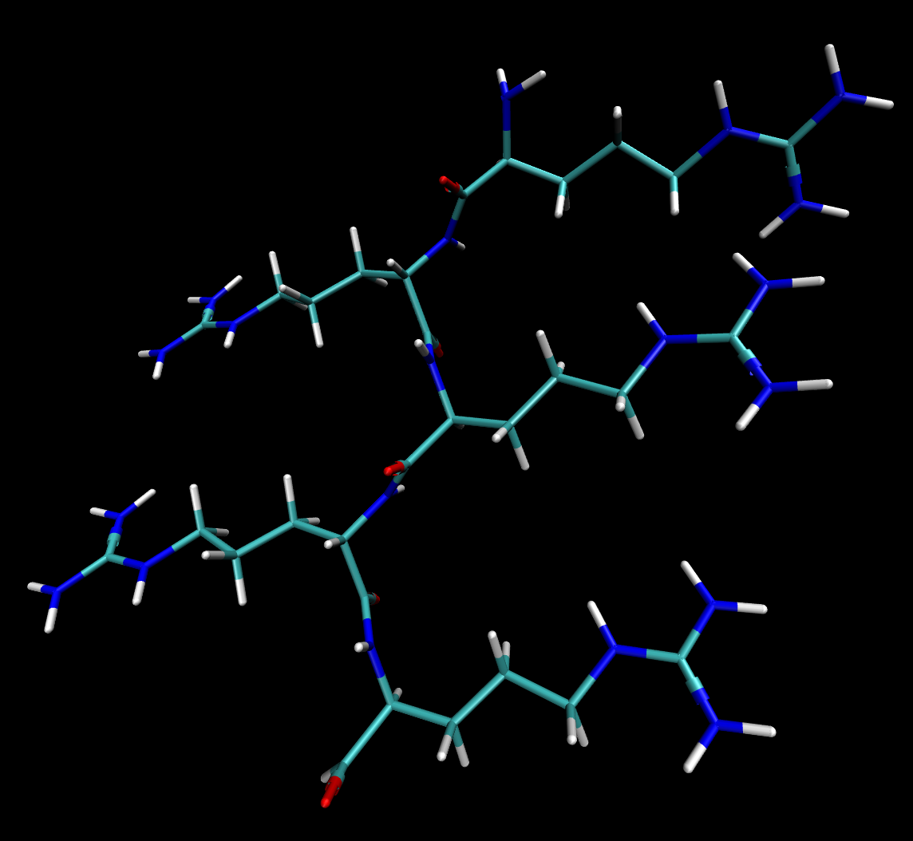
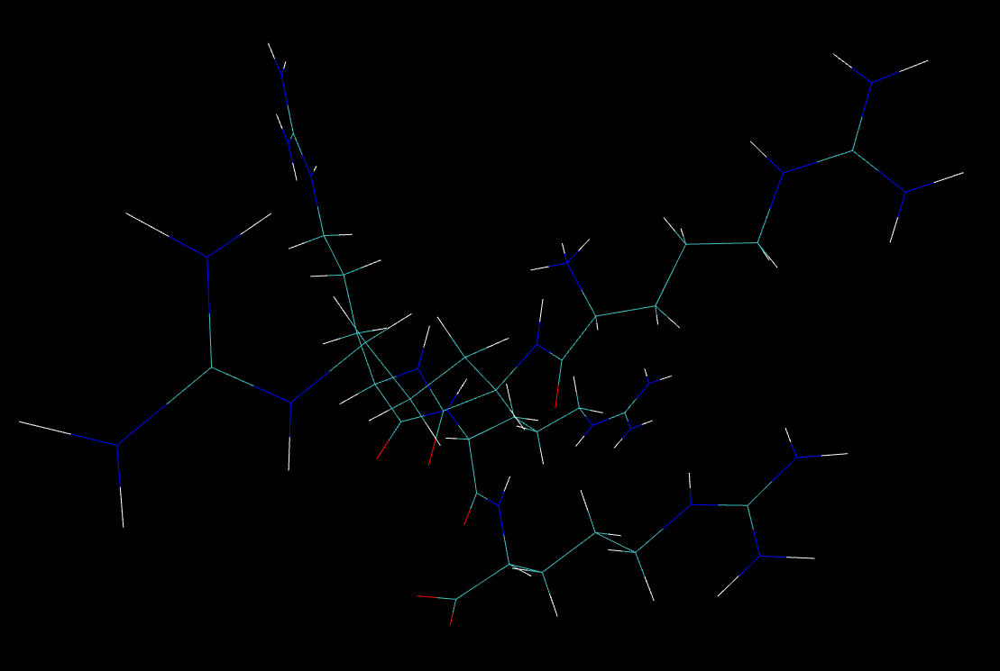
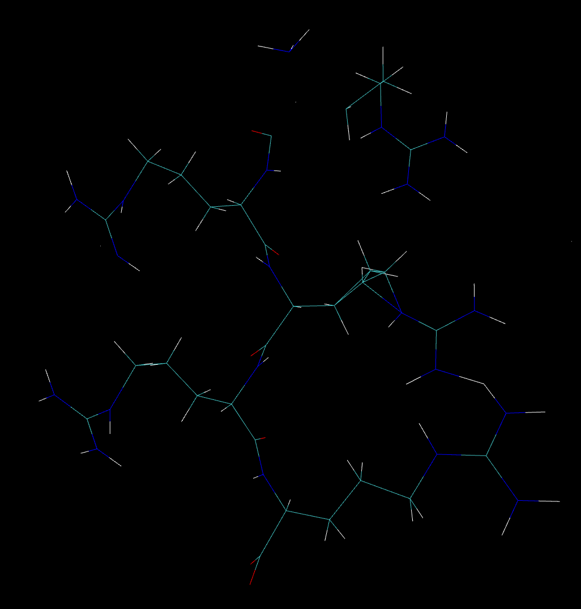

## Examples of function ```setDihedralList```

This example shows how DROP can manipulate a protein structure by providing a list of dihedral angles to DROP.

NOTE: There are no dynamics happening here. The dihedral angles of the Villin Headpiece crystal structure are known and DROP is being told to change the backbone dihedral angles to the correct orientations. This is not an example of "solved" protein folding.

### Polyarginine

First, let's take a 5-mer polyarginine in a beta sheet configuration and convert it to an alpha helix conformation. Our initial conformation is in ```Polyarginine/poly-R-beta.png```:



Then we will run the following command from the parent directory: ```./drop setDihedralList -i examples/setDihedralList/Polyarginine/poly-R-beta.pdb -d examples/setDihedralList/Polyarginine/beta-to-helix.txt -o poly-R-helix.pdb```

Here is a visualization of ```Polyarginine/poly-R-helix.pdb```:



Both images have the peptide oriented with the N-terminus and C-terminus at the top and bottom center, respectively. You can also do this with side chain torsions or combinations of backbone and side chain torsions in the file provided to ```-d```.

As an example with side chain angles, you can run this command: ```./drop setDihedralList -i examples/setDihedralList/Polyarginine/poly-R-beta.pdb -d examples/setDihedralList/Polyarginine/side-chain.txt -o poly-R-beta-SC.pdb```

Here is a visualization of (the broken) modified structure ```Polyarginine/poly-R-beta-SC.png```:



### Villin Headpiece
